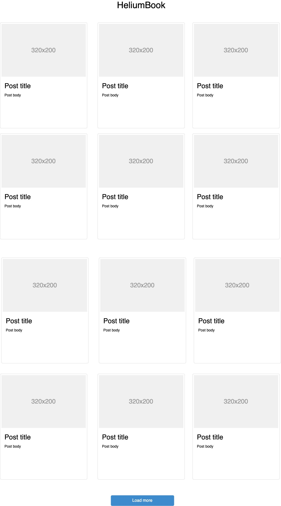
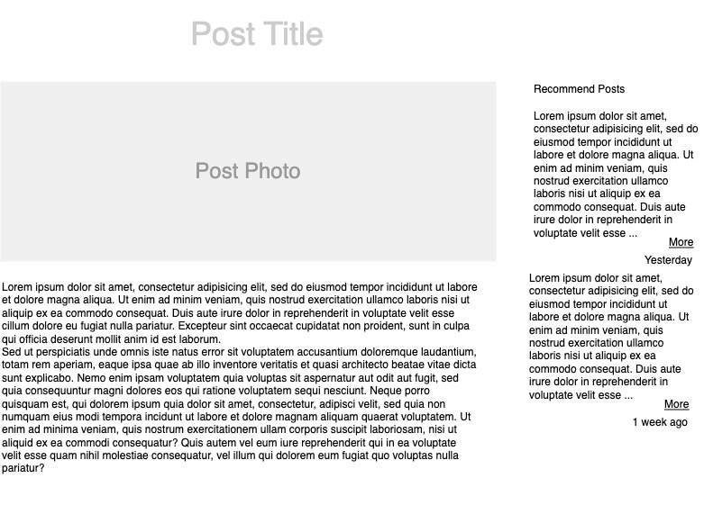

# Frontend Assignment 

### Description 

For this assignment, you will be creating a simple frontend application based on NextJS. It is a simple web application
that fetches and shows a list of posts from an endpointز
### Functions
You will be using [DummyAPI.io](https://dummyapi.io/) to fetch the data and display it on the frontend, 
You can create a free account or ask us to provide you with an ID. You have to implement the following pages:
1. Homepage: Shows 12 posts from the API. It also has load more button that fetches more posts when clicked. if you clicked 
on post card, it should navigate to the post page.

2. Post Details: shows the details of a post. it also has recommended posts which is a list of random posts from the API.

### Constraints
There are some constraints that you should be aware of. Not completing any of the following constraints will stop your candidacy from moving forward:
- You must use NextJS. 
- You must use Redux for state management.
- You must deploy your code to Vercel.
- You must use Bootstrap only as a css toolkit.

### Assessment
You will be given a score based on the following criteria:
1. **Code quality**. 
2. **Application performance**. We will be using [PageSpeed Insights](https://pagespeed.web.dev/) to measure the performance of your application.
3. **Automated testing**: It is up to you which automated testing framework/type you will use.
4. **SEO** : We will be using [This tool](https://smallseotools.com/website-seo-score-checker/) to measure the SEO score of your application.

### Submission
You should upload your code to a Github repository (private or public) and share it with me. Your repository should have a README.md that explains how to run the code and if you’ve done anything extra. **If you fail to produce this repository within the time period mentioned in the email you received your application will be rejected.**

Best of luck!

